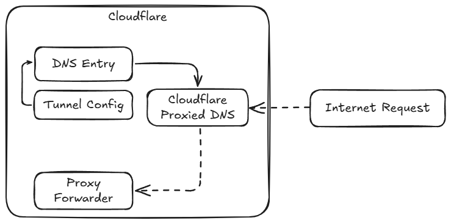
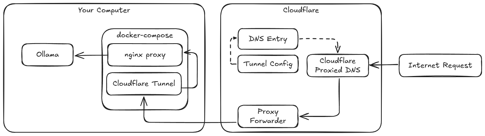

# Cloudflare Tunnel Proxy for Ollama
The tunnel proxy for Ollama allows you to securely expose your Ollama service through a Cloudflare Tunnel, providing an additional layer of security and ease of access.

In this example, a tunnel will be created to expose the Ollama service running on localhost port 11434.

You will need a Cloudflare account and a domain controlled by Cloudflare that you can use to point to the Cloudflare Tunnel.

## About the Tunnel Configuration
The tunnel works by creating a public DNS record that points to a Cloudflare Tunnel CNAME entry. This allows the Cloudflare
to obfuscate the IP address through their network while still providing a reliable URL to access the service.

_Diagram of the Cloudflare Tunnel_

## Instructions to Create the Tunnel
Follow the [Create a tunnel (dashboard)](https://developers.cloudflare.com/cloudflare-one/connections/connect-networks/get-started/create-remote-tunnel/) instructions to complete the setup. Here are a few tips:
1. On the first step, it gives you an option to install and run a connector, but you do not need to run it as the docker-compose file will do this. 
   1. Instead, click on the command they provide to get the long string of characters which are the `CLOUDFLARE_TUNNEL_TOKEN` needed for this project.
2. Click "Next" to proceed to the Route tunnel step.
   1. Use "Public hostnames," versus "Private networks," and for the hostname, use a subdomain of your choice, such as `ollama`, and then select the domain registered with Cloudflare.
   2. The Service entry corresponds to the URL of nginx service running in the docker-compose container. The container will be running `cloudflared` and will forward requests to the nginx URL, which is always `http://localhost` (port 80).
3. Click "Complete Setup" to finish the tunnel creation.

**Note**: You must finish all the steps in the Tunnel setup before the proxy will work. Otherwise, you will see errors
in the proxy agent logs like:

> No ingress rules were defined in provided config (if any) nor from the cli, cloudflared will return 503 for all incoming HTTP requests nginx

Once the tunnel is created, nginx will be able to forward requests incoming from the Cloudflare Tunnel to `http://host.docker.internal:11434` which should be the Ollama service running on your host machine.

_Diagram of the active tunnel_
